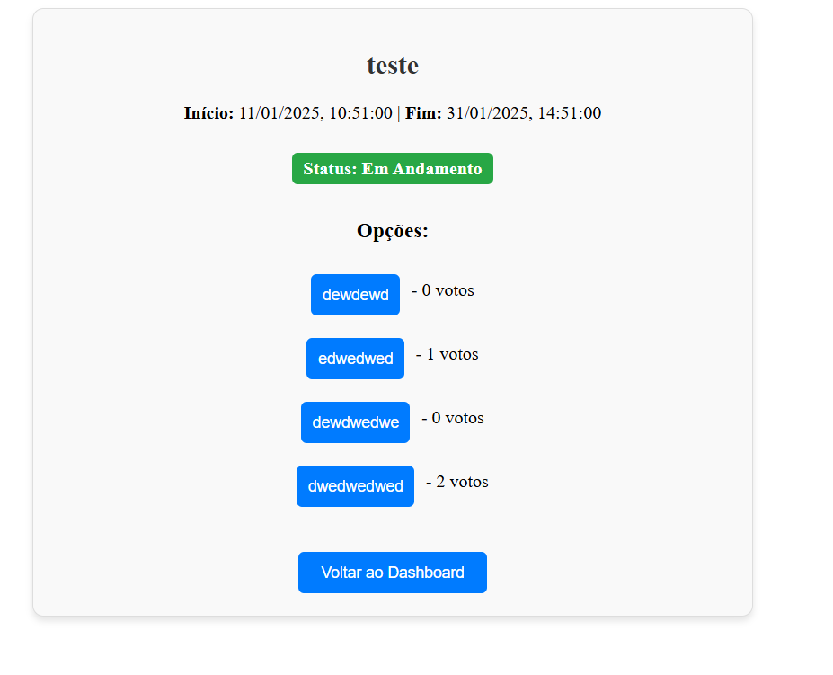
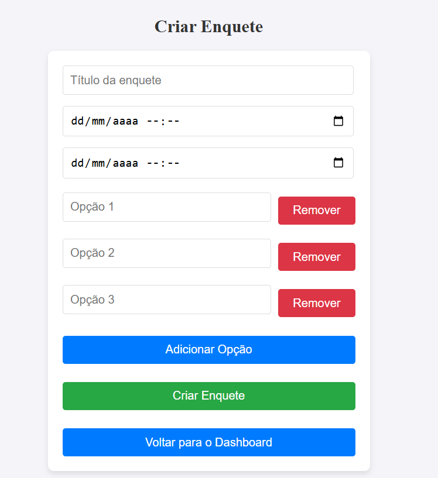
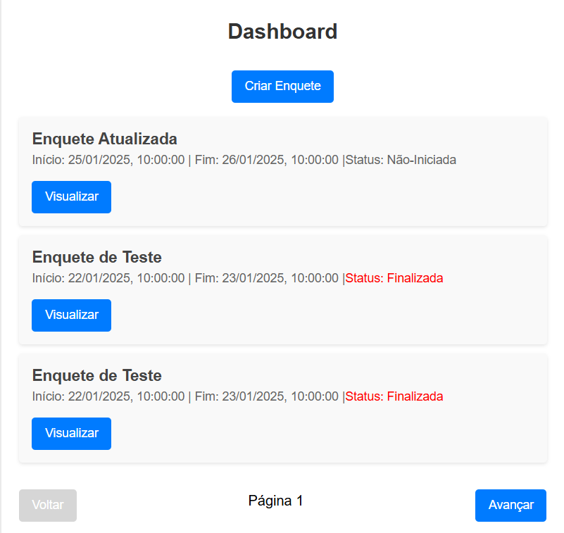

# Boas-vindas ao repositório do teste de projeto  signo tech!

Obrigado por dedicar um tempo para visitar este repositório! Aqui você encontrará todas as informações detalhadas sobre o desenvolvimento deste projeto, desde as funcionalidades implementadas até os aprendizados adquiridos ao longo do processo.

O objetivo foi criar uma aplicação funcional, integrando front-end, back-end e banco de dados, enquanto utilizava boas práticas de desenvolvimento. Espero que a apresentação atenda às expectativas e seja clara quanto ao trabalho realizado.

Sinta-se à vontade para explorar cada seção clicando nos tópicos abaixo. Desejo uma excelente leitura e ficarei muito feliz em receber seu feedback! 😊

 

  
<strong>👨‍💻 O que eu desenvolvi</strong>
 

eu desenvolvi um sistema de votação Com um back (crud completo de criação/edição/exclusão) com gerenciamento de enquete 
e opções.

  
<strong>👨‍💻 requisitos cobrados</strong>
 

- A enquete deve ter um título e uma data programada para início e para término.

- O cadastro de opções de respostas da enquete devem ser dinâmicas, é obrigatório 
mínimo 3 opções. 

- Listar todas as enquetes cadastradas no banco com o título e data de início e 
término, apresentar todas as enquetes, não iniciadas/em andamento/finalizadas. 

- Criar tela de apresentar a enquete com opções de resposta, com a data de início e 
término. Essa tela deve obedecer: 
Ao lado de cada opção, apresentar os números de votação total do lado de cada 
opção. 
Se a enquete não estiver ativa entre data/hora início e data/hora fim, as opções e o 
botão de votar deve estar desabilitado. 
Os números de resultados devem ser apresentados sempre que houver novo voto 
(realtime)

 

  
<strong>Habilidades Adquiridas após realizar este projeto</strong>
 

Nesse projeto, eu fui capaz de:

  - Durante o desenvolvimento desse teste, as seguintes tecnologias e ferramentas foram utilizadas:

Frontend:
- React: Biblioteca JavaScript para a construção de interfaces de usuário.
Backend:
- Node.js: Ambiente de execução JavaScript para o desenvolvimento do backend.
WebSocket: protocolo de comunicação que permite uma conexão persistente entre o cliente (por exemplo, seu navegador) e o servidor
- MySQL: Sistema de gerenciamento de banco de dados relacional.
- DBeaver: Ferramenta para gerenciar bancos de dados e realizar consultas.
- Visual Studio Code: Editor de código com suporte a várias extensões para o desenvolvimento.
- Postman e Thunder client: Plataforma para testar APIs e realizar chamadas HTTP.
- GitHub: Repositório para versionamento de código e colaboração.

      
<strong>Desafios Enfrentados ao realizar esse projeto</strong>
 
Durante o desenvolvimento desse teste, alguns desafios se destacaram, especialmente relacionados à lógica de banco de dados e à integração entre o back-end e o front-end.

- Integração Back-End/Front-End:
Meu maior ponto de desafio foi a integração do banco de dados com o back-end e a comunicação com o front-end. Houve desafios para garantir que os dados fossem corretamente carregados e exibidos na interface, e para sincronizar as ações do usuário com o armazenamento e a manipulação dos dados no banco.

Esses desafios foram superados com bastante tentativa e erro, além de pesquisa e ajustes no código.

 
